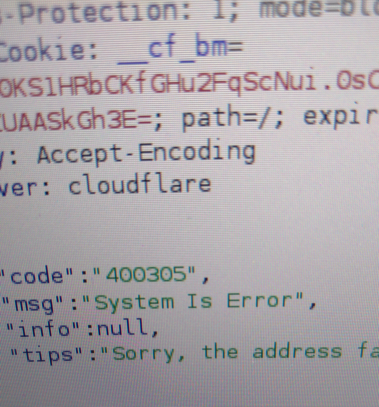

# About {{site.title}}
A collection of write-ups and research on real-world cyber security, which hopefully will grow in time.
It is named after a ridiculous error message returned from a bug bounty target, in the spirit of <a href="https://en.wikipedia.org/wiki/All_your_base_are_belong_to_us">"all your base are belong to us"</a>:

# About oneinctrl
An Application Security & Software engineer, aspiring bug bounty researcher and ethical hacker.
